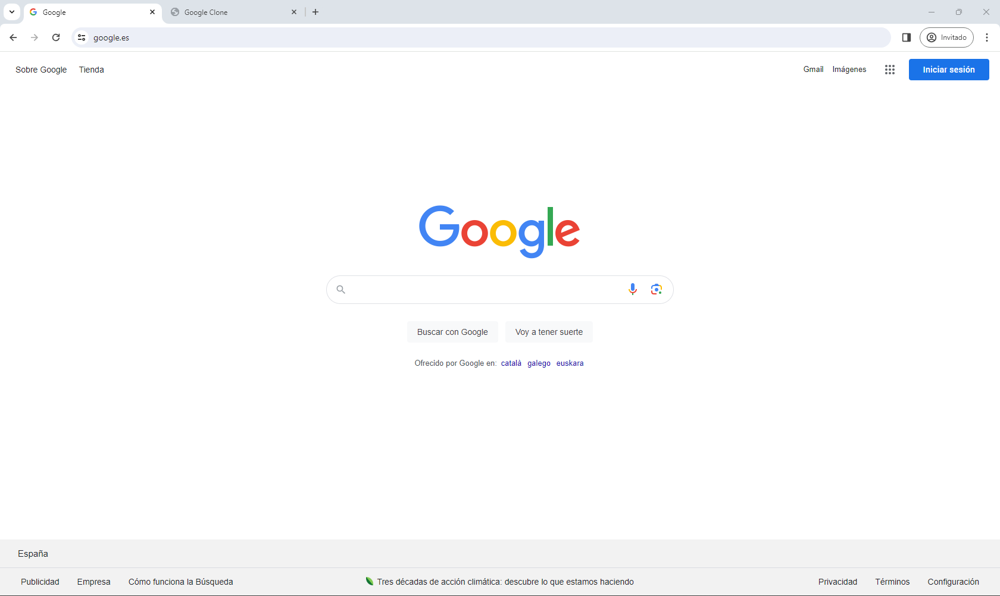

# ¿Copia la página principal de Google

La mejor manera de poder poner en práctica todo lo que hemos aprendido en HTML y CSS es copiando una web sencilla como es https://www.google.com/

## ¿Qué tengo que hacer?
Sencillo, copiar el aspecto de la web completa, no la funcionalidad, es decir, lo que ves tendrás que reproducirlo de la manera más similar que puedas en tu proyecto. 

Comienza por la estructura de archivos y carpetas del proyecto. 

- index.html
- styles.css
- assets/img

No olvides crear bien la estructura del HTML y "enganchar" las CSS.

En el momento de crear el ejercicio tiene el siguiente aspecto:

WARNING! Si la web no se parece en el momento de realizar el ejercicio usa tu ingenio, consigue las imagenes y haz la estructura similar en ese momento. Haz captura de pantalla para ver el progreso y poder adjuntarlo en tu README.

## ¿Qué usaremos?
- Etiquetas semánticas
- Inputs
- Títulos
- Backgrounds
- Sombreados
- Borders
- Margins y paddings
- Flex
- ...

Puedes usar todo lo de la lista y además lo que se te ocurra para poder hacer que tu proyecto se parezca a lo que ves. No hay límites.

# BONUS

Intenta que la tipográfia sea igual o similar a lo que ves. Usa la imaginación (e internet) para poder encontrar la manera de saber que tipografía es y como ponerla en tu proyecto.

